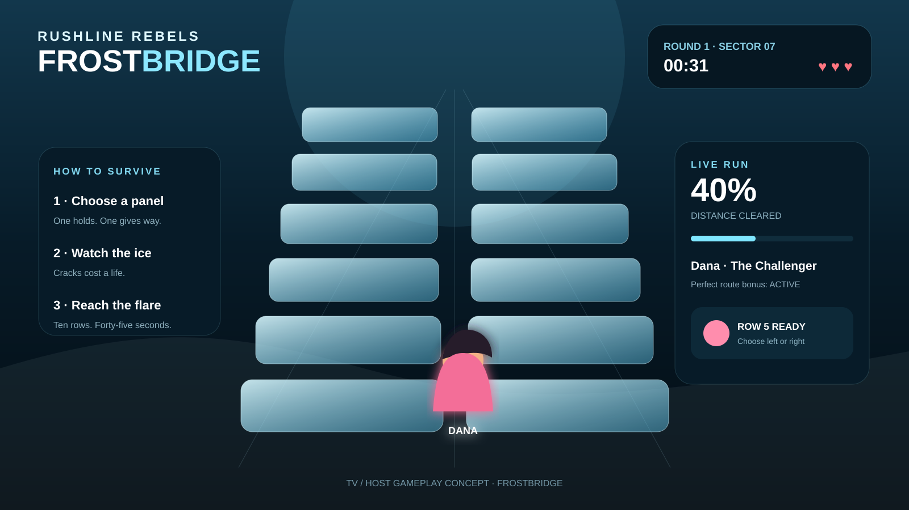
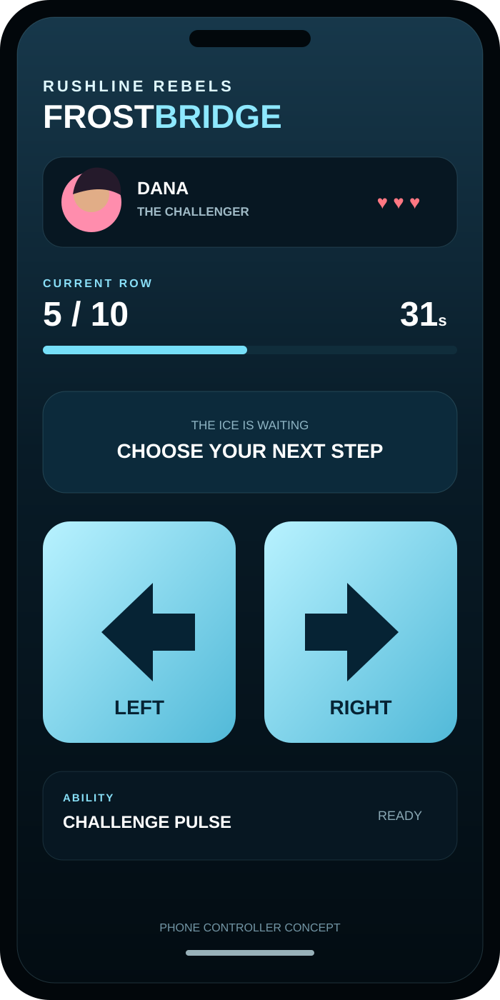
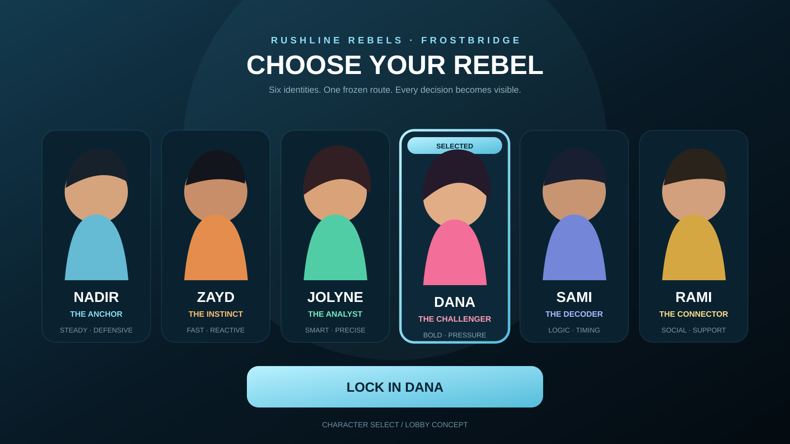

# Rushline Rebels: Frostbridge

Standalone interactive design prototype for a new **Rushline Rebels** party-survival game built around a two-lane frozen bridge.

## Visual mockups

### TV / host gameplay



### Phone controller



### Character selection / lobby



## Core loop

- Pick a Rushline Rebels character.
- Start a 45-second run.
- Each bridge row has two ice panels; one is stable and one breaks.
- A correct choice advances the character.
- A broken panel costs one of three lives and applies a time penalty.
- Clear all 10 rows before the timer or lives expire.

## Rushline Rebels cast

- Nadir — The Anchor
- Zayd — The Instinct
- Jolyne — The Analyst
- Dana — The Challenger
- Sami — The Decoder
- Rami — The Connector

Character artwork is stored in `assets/characters/` so this repository remains self-contained.

## Interactive prototype

`index.html` is the playable browser mock and demonstrates character selection, randomized safe/breaking ice panels, lives, countdown timer, progress HUD, tile failure animation, fall/win states, and responsive desktop/mobile layouts.

Run locally:

```bash
python -m http.server 8080
```

Then open `http://localhost:8080/`.

## Production target

The production version is designed around three coordinated surfaces:

1. **TV / host:** bridge, all players, timer, eliminations, spectator state, audio and VFX.
2. **Player phone:** character selection, large LEFT / RIGHT controls, vibration and personal status.
3. **Host/controller:** round start, stage count, timer, lives, difficulty and player states.

The host remains authoritative over the bridge seed and safe-panel pattern until each choice resolves. Planned modes include Classic, Blitz, Memory Trail, Team Relay and Last Rebel Standing.
